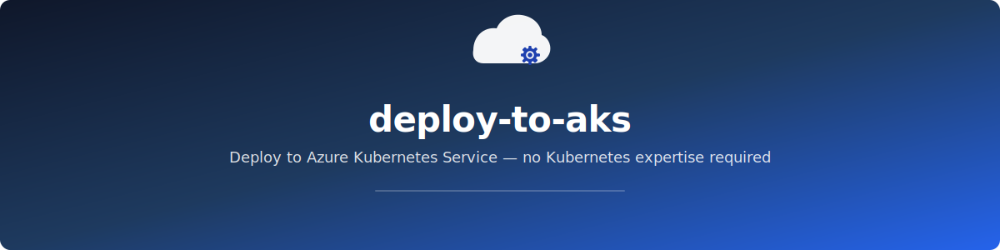
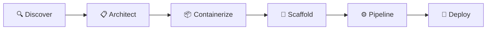

[](https://docs.anthropic.com/en/docs/claude-code/overview)
[](https://docs.github.com/en/copilot)
[](https://opencode.ai)

A conversational AI skill that reads your project, generates production-ready deployment artifacts, and deploys to AKS — all from your terminal. No Kubernetes expertise required.

## How it works



| | Phase | What happens |
|---|---|---|
| 🔍 | **Discover** | Scans your project, detects framework and dependencies |
| 📋 | **Architect** | Plans infrastructure, shows architecture diagram + cost estimate |
| 📦 | **Containerize** | Generates production-ready Dockerfile + .dockerignore |
| 🔧 | **Scaffold** | Generates K8s manifests + Bicep IaC, validates against safeguards |
| ⚙️ | **Pipeline** | Creates GitHub Actions CI/CD with OIDC auth |
| 🚀 | **Deploy** | Executes deployment with confirmation gates, shows summary dashboard |

File generation is automatic. CLI commands (`az`, `docker`, `kubectl`, `gh`) require your explicit confirmation before running.

## What it generates

Example output for a Spring Boot app with PostgreSQL on AKS Automatic — actual files vary based on your project:

```
your-project/
├── Dockerfile                  # Multi-stage, non-root, optimized
├── .dockerignore
├── k8s/
│   ├── namespace.yaml          # App namespace
│   ├── deployment.yaml         # Resource limits, probes, security context
│   ├── service.yaml            # ClusterIP
│   ├── configmap.yaml          # App configuration
│   ├── gateway.yaml            # Gateway API (Automatic) or ingress.yaml (Standard)
│   ├── httproute.yaml          # Routing rules (Automatic only)
│   ├── hpa.yaml                # Horizontal Pod Autoscaler
│   ├── pdb.yaml                # Pod Disruption Budget
│   └── serviceaccount.yaml     # Workload Identity
├── infra/
│   ├── main.bicep              # Orchestrator
│   ├── main.bicepparam         # Parameter values
│   ├── aks.bicep               # AKS cluster
│   ├── acr.bicep               # Container Registry
│   ├── identity.bicep          # Managed Identity + federation
│   └── postgres.bicep          # Backing services (postgres, redis, keyvault, etc.)
└── .github/workflows/
    └── deploy.yml              # Build → push → deploy with OIDC
```

✅ All manifests pass **AKS Deployment Safeguards** out of the box
✅ Dockerfiles follow multi-stage, non-root, layer-cached best practices
✅ CI/CD uses OIDC federation — no stored secrets
✅ Adapts to your stack — detects what exists before generating

## Installation

**Quick install** (recommended):

```bash
curl -fsSL https://raw.githubusercontent.com/gambtho/deploy-to-aks-skill/main/install.sh | bash
```

The script prompts for your platform and whether to install globally or into a specific project.

<details>
<summary>Alternative: Clone and install</summary>

```bash
git clone https://github.com/gambtho/deploy-to-aks-skill.git
cd deploy-to-aks-skill
./install.sh
```

</details>

<details>
<summary>Non-interactive install with flags</summary>

```bash
# Global install for Claude Code
curl -fsSL https://raw.githubusercontent.com/gambtho/deploy-to-aks-skill/main/install.sh | bash -s -- --platform claude-code --scope global

# Project install for GitHub Copilot
curl -fsSL https://raw.githubusercontent.com/gambtho/deploy-to-aks-skill/main/install.sh | bash -s -- --platform copilot --scope project --project-dir /path/to/your/project

# Global install for OpenCode
curl -fsSL https://raw.githubusercontent.com/gambtho/deploy-to-aks-skill/main/install.sh | bash -s -- --platform opencode --scope global
```

Available flags:
- `--platform`: `claude-code`, `copilot`, or `opencode`
- `--scope`: `global` or `project` (copilot only supports `project`)
- `--project-dir`: Required when `--scope project` is used

</details>

<details>

<summary>Manual install — Claude Code</summary>

**Global install** (available in all your projects):

```bash
git clone https://github.com/gambtho/deploy-to-aks-skill.git
ln -s "$(pwd)/deploy-to-aks-skill/skills/deploy-to-aks" ~/.claude/skills/deploy-to-aks
```

**Project install** (available only in one project):

```bash
# From your project root:
mkdir -p .claude/skills
cp -r /path/to/deploy-to-aks-skill/skills/deploy-to-aks .claude/skills/deploy-to-aks
```

</details>

<details>

<summary>Manual install — GitHub Copilot</summary>

Copilot does not have a global skill system. Install into each project that needs it:

```bash
# From your project root:
mkdir -p .github/skills
cp -r /path/to/deploy-to-aks-skill/skills/deploy-to-aks .github/skills/deploy-to-aks
```

Then create or append to `.github/copilot-instructions.md`:

```markdown
## AKS Deployment Skill

When the developer asks for help deploying to Azure Kubernetes Service (AKS),
containerizing their application for AKS, generating Kubernetes manifests, or
creating Bicep infrastructure for Azure, follow the phased deployment guide
in `.github/skills/deploy-to-aks/SKILL.md`.

Trigger phrases include:
- "deploy to AKS" / "deploy to Azure Kubernetes Service"
- "containerize this for AKS" / "create a Dockerfile for AKS"
- "generate Kubernetes manifests" / "scaffold K8s for Azure"
- "create Bicep infrastructure" / "set up AKS infrastructure"
- "help me deploy to Azure"

Start by reading `.github/skills/deploy-to-aks/SKILL.md`, then follow its
instructions phase by phase. Do not skip phases or reorder them.
```

</details>

<details>

<summary>Manual install — OpenCode</summary>

**Global install** (available in all your projects):

```bash
git clone https://github.com/gambtho/deploy-to-aks-skill.git
mkdir -p ~/.config/opencode/skills
ln -s "$(pwd)/deploy-to-aks-skill/skills/deploy-to-aks" ~/.config/opencode/skills/deploy-to-aks
```

**Project install** (available only in one project):

```bash
# From your project root:
mkdir -p .opencode/skills
cp -r /path/to/deploy-to-aks-skill/skills/deploy-to-aks .opencode/skills/deploy-to-aks
```

</details>

**Verify installation:** Start your agent in the target project and ask `What skills are available?` — you should see `deploy-to-aks` in the list. For Copilot, ask "help me deploy to AKS" to verify it activates.

## Uninstalling

<details>

<summary>Claude Code</summary>

**Global:** `rm -rf ~/.claude/skills/deploy-to-aks`

**Project:** `rm -rf .claude/skills/deploy-to-aks` (from the project root)

</details>

<details>

<summary>GitHub Copilot</summary>

```bash
# From the project root:
rm -rf .github/skills/deploy-to-aks
```

Then remove the `## AKS Deployment Skill` block from `.github/copilot-instructions.md`.

</details>

<details>

<summary>OpenCode</summary>

**Global:** `rm -rf ~/.config/opencode/skills/deploy-to-aks`

**Project:** `rm -rf .opencode/skills/deploy-to-aks` (from the project root)

</details>

## Usage

Navigate to the project you want to deploy and ask your agent:

```
Help me deploy this app to AKS
```

| Platform | How to invoke |
|----------|--------------|
| **Claude Code** | Ask naturally: "help me deploy to AKS" (skill activates automatically) |
| **GitHub Copilot** | Ask naturally: "help me deploy to AKS" (no slash command) |
| **OpenCode** | Ask naturally: "help me deploy to AKS" (skill activates automatically) |

The skill walks you through all 6 phases interactively. You approve the architecture and cost estimate before any resources are created.

## See it in action

*Demo recording coming soon — a 60-second walkthrough from `Help me deploy this app to AKS` to a running application.*

## Supported frameworks

All listed frameworks get production-ready multi-stage Dockerfile generation and full AKS deployment support. Frameworks with a **knowledge pack** get deeper guidance — optimized Dockerfiles, health endpoint setup, database configuration, DS012 writable-path handling, and AKS-specific troubleshooting.

| Language | Frameworks | Knowledge Pack |
|----------|-----------|---------------|
| Node.js | Express, Fastify, Next.js, NestJS | Yes |
| Python | FastAPI, Django, Flask | Yes |
| Java | Spring Boot, Quarkus | Spring Boot only |
| Go | Gin, Echo, Fiber, stdlib | Yes |
| .NET | ASP.NET Core | Yes |
| Rust | Actix, Axum | Dockerfile template only |

## AKS flavors

- **AKS Automatic** (default) — fully managed, Gateway API, Deployment Safeguards enforced
- **AKS Standard** — more control over node pools, ingress, networking

## Prerequisites

- An Azure subscription (Owner or Contributor role)
- [Azure CLI](https://learn.microsoft.com/en-us/cli/azure/install-azure-cli) installed and logged in (`az login`)
- [Docker](https://docs.docker.com/get-docker/) installed
- [kubectl](https://kubernetes.io/docs/tasks/tools/) installed (or let the skill install it via `az aks install-cli`)
- [GitHub CLI](https://cli.github.com/) installed (for CI/CD phase)
- One of the supported AI coding agents:
  - [Claude Code](https://docs.anthropic.com/en/docs/claude-code/overview)
  - [GitHub Copilot](https://docs.github.com/en/copilot) (VS Code or compatible IDE with Copilot Chat)
  - [OpenCode](https://opencode.ai)

## Inspiration

Inspired by [adaptive-ui-try-aks](https://github.com/sabbour/adaptive-ui-try-aks) — a browser-based conversational deployment guide by sabbour. This skill brings the same concept to the terminal with the added power of real codebase intelligence, direct CLI execution, and zero-setup integration.
