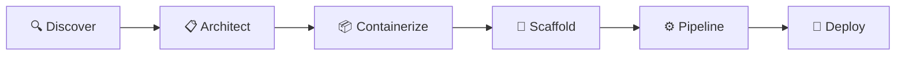

# README Redesign — Design Spec

**Date:** 2026-04-02
**Status:** Approved
**Author:** Brainstormed collaboratively via Claude Code

---

## 1. Overview

### Problem

The current README is functional but plain. It reads like technical documentation rather than a landing page. For the target audience — developers evaluating whether to use this skill to deploy their apps to AKS — the README needs to sell the experience, build trust, and get them to install fast.

### Solution

Redesign the README as a "product landing page" using the hybrid approach: an SVG banner for visual identity, Mermaid diagrams for the phase pipeline, an annotated file tree for the "wow" moment, and a terminal demo GIF to confirm the experience. Collapse verbose install instructions behind `<details>` tags. Move reference material (prerequisites) to the bottom.

### Design Principles

- **Approachable first, then polished and powerful.** The tone should make someone feel "this looks easy and well-made" before "this is technically deep."
- **Show, don't tell.** The file tree, Mermaid diagram, and demo GIF do more than paragraphs of description.
- **Respect the scroll.** Every screen-height of the README should earn its place. The user should be able to install within 2 scrolls.

---

## 2. Target Audience

Application developers who want to use the skill to deploy their apps to AKS. They found the repo on GitHub or were told about it. They are evaluating whether to try it. They are not contributors to the skill itself.

---

## 3. README Structure (Top to Bottom)

### 3.1 Hero Section — SVG Banner + Badges

**Banner:** A horizontal SVG file (`docs/images/banner.svg`) with:
- Subtle dark-to-blue gradient (Azure-inspired, `#0f172a` → `#1e3a5f` → `#2563eb`)
- Small Azure/Kubernetes-inspired icon mark (gear + cloud or similar, using inline SVG paths)
- Project name "deploy-to-aks" in clean sans-serif
- Tagline: "Deploy to Azure Kubernetes Service — no Kubernetes expertise required"

The banner is embedded via `` and renders crisp at any width.

**Badges row** (immediately below the banner):
- License — shields.io badge (only if a LICENSE file exists in the repo; skip otherwise)
- Claude Code — supported (green)
- GitHub Copilot — supported (green)
- OpenCode — supported (green)

3-4 badges max. No version, no build status (no CI), no filler.

**Value proposition** (1-2 sentences below badges):
A short, punchy description — tighter than the current opening paragraph. Something like: "A conversational AI skill that reads your project, generates production-ready deployment artifacts, and deploys to AKS — all from your terminal."

### 3.2 How It Works — Mermaid Diagram + Emoji Table

**Mermaid flow diagram:** A left-to-right pipeline showing the 6 phases as connected nodes. Renders natively on GitHub. Communicates the "it's a pipeline" concept at a glance.



Each node includes the phase emoji and name. Keep it single-line (no sub-descriptions in nodes) — the table below provides the detail. Style with rounded edges if the Mermaid theme supports it.

**Emoji table** (below the diagram): A compact table with one row per phase, an emoji icon, the phase name, and a one-line description of what happens.

| | Phase | What happens |
|---|---|---|
| 🔍 | **Discover** | Scans your project, detects framework and dependencies |
| 📋 | **Architect** | Plans infrastructure, shows architecture diagram + cost estimate |
| 📦 | **Containerize** | Generates production-ready Dockerfile + .dockerignore |
| 🔧 | **Scaffold** | Generates K8s manifests + Bicep IaC, validates against safeguards |
| ⚙️ | **Pipeline** | Creates GitHub Actions CI/CD with OIDC auth |
| 🚀 | **Deploy** | Executes deployment with confirmation gates, shows summary |

A one-liner below the table: "File generation is automatic. CLI commands require your explicit confirmation before running."

### 3.3 What It Generates — Annotated File Tree + Callouts

**Annotated file tree** in a fenced code block:

```
your-project/
├── Dockerfile                  # Multi-stage, non-root, optimized
├── .dockerignore
├── k8s/
│   ├── deployment.yaml         # Resource limits, probes, security context
│   ├── service.yaml            # ClusterIP
│   ├── gateway.yaml            # Gateway API (Automatic) or Ingress (Standard)
│   ├── httproute.yaml
│   ├── hpa.yaml                # Horizontal Pod Autoscaler
│   ├── pdb.yaml                # Pod Disruption Budget
│   └── serviceaccount.yaml     # Workload Identity
├── infra/
│   ├── main.bicep              # Orchestrator
│   ├── aks.bicep               # AKS cluster
│   ├── acr.bicep               # Container Registry
│   ├── identity.bicep          # Managed Identity + federation
│   └── postgres.bicep          # ...and any backing services
└── .github/workflows/
    └── deploy.yml              # Build → push → deploy with OIDC
```

**Callout lines** (below the tree):
- All manifests pass **AKS Deployment Safeguards** out of the box
- Dockerfiles follow multi-stage, non-root, layer-cached best practices
- CI/CD uses OIDC federation — no stored secrets
- Adapts to your stack — detects what exists before generating

### 3.4 Installation — Quick Install + Collapsed Details

**Quick install** (visible by default):

```bash
git clone https://github.com/<owner>/deploy-to-aks-skill.git
cd deploy-to-aks-skill
./install.sh
```

One-liner explaining the script prompts for platform and install scope.

**Per-platform manual instructions:** Three `<details>` blocks (collapsed by default):
- `<details><summary>Manual install — Claude Code</summary>` — global + project instructions
- `<details><summary>Manual install — GitHub Copilot</summary>` — project install + copilot-instructions.md setup
- `<details><summary>Manual install — OpenCode</summary>` — global + project instructions

**Verify installation** stays as-is, just tightened.

### 3.5 Usage

Same structure as current, tightened copy. The code block prompt + platform table.

### 3.6 Demo — Terminal Recording

A terminal recording (asciinema SVG or GIF) placed after the install and usage sections. The reading flow is: get excited (hero + features) → install → see it in action (GIF confirms the decision).

**What the recording should show** (30-60 seconds):
1. Invoke the skill in a real project
2. Discover phase detecting the framework
3. Architect phase showing the Mermaid diagram + cost estimate
4. Quick flash of generated files
5. Summary dashboard at the end

The recording will be created separately and stored at `docs/images/demo.svg` (asciinema) or `docs/images/demo.gif`.

### 3.7 Supported Frameworks

Single-line format (not a table): "Node.js (Express, Fastify, Next.js, Nest) · Python (Flask, FastAPI, Django) · Java (Spring Boot, Quarkus) · Go (Gin, Echo, Fiber) · .NET (ASP.NET) · Rust"

### 3.8 AKS Flavors

Two brief lines:
- **AKS Automatic** (default) — fully managed, Gateway API, Deployment Safeguards enforced
- **AKS Standard** — more control over node pools, ingress, networking

### 3.9 Prerequisites

Moved here from near the top. Same content as current: Azure subscription, Azure CLI, Docker, GitHub CLI, supported agent. This is reference material someone checks when they're ready to install, not part of the hook.

### 3.10 Inspiration

Same as current — credit to adaptive-ui-try-aks by sabbour.

---

## 4. Assets to Create

| Asset | Format | Location | Notes |
|-------|--------|----------|-------|
| Banner | SVG | `docs/images/banner.svg` | Dark-to-blue gradient, icon mark, project name + tagline |
| Demo recording | SVG (asciinema) or GIF | `docs/images/demo.svg` or `demo.gif` | 30-60s showing skill in action; created by running the skill against a real project |

The banner SVG can be created as a hand-crafted SVG file (inline paths, no external dependencies). No build tooling or image editors required.

The demo recording is created separately by running the skill against a test project (e.g., spring-petclinic) and recording the terminal session. This is a manual step, not automated.

---

## 5. Sections Removed

| Section | Reason | Where it lives now |
|---------|--------|--------------------|
| Project structure | Contributor info, not user info | Already in AGENTS.md |
| Status ("v1 complete") | Low-value standalone section | Can be a one-liner in Inspiration or dropped entirely |

---

## 6. Content Principles

- **No emoji in prose** — emoji in the phase table icons is fine, but running text stays clean and professional.
- **Callouts use checkmarks** (✅) — reinforces "this is production-ready" messaging.
- **Code blocks use dark theme** — GitHub renders fenced blocks with syntax highlighting; the file tree block uses no language tag for a clean monospace look.
- **Mermaid renders natively** — no images needed for the phase diagram; GitHub renders ```mermaid blocks inline.
- **Badges from shields.io** — consistent style, static badges (not tied to a CI system).
