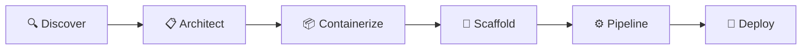

# README Redesign Implementation Plan

> **For agentic workers:** REQUIRED SUB-SKILL: Use superpowers:subagent-driven-development (recommended) or superpowers:executing-plans to implement this plan task-by-task. Steps use checkbox (`- [ ]`) syntax for tracking.

**Goal:** Redesign the README as a visually impressive product landing page that hooks developers, builds trust, and gets them to install fast.

**Architecture:** Three deliverables — (1) an SVG banner asset with Azure-inspired gradient and icon mark, (2) the rewritten README.md structured as a landing page with Mermaid diagram, annotated file tree, and collapsed install sections, and (3) a placeholder + instructions for the terminal demo recording (manual step).

**Tech Stack:** SVG (hand-crafted banner), Markdown (README with Mermaid, shields.io badges, `<details>` blocks)

---

## File Map

| Action | File | Responsibility |
|--------|------|---------------|
| Create | `docs/images/banner.svg` | Hero banner: dark-to-blue gradient, cloud+gear icon mark, project name, tagline |
| Rewrite | `README.md` | Full README rewrite per spec sections 3.1–3.10 |

---

### Task 1: Create the SVG Banner

**Files:**
- Create: `docs/images/banner.svg`

- [ ] **Step 1: Create the `docs/images/` directory**

```bash
mkdir -p docs/images
```

- [ ] **Step 2: Create `docs/images/banner.svg`**

Write a hand-crafted SVG file with these specifications:

- **Dimensions:** `viewBox="0 0 1200 300"`, `width="100%"` (responsive)
- **Background:** `<linearGradient>` from `#0f172a` (left) → `#1e3a5f` (middle) → `#2563eb` (right), at 135° angle
- **Icon mark:** A combined cloud + gear symbol, built from SVG `<path>` elements, positioned center-top. White fill, ~48px visual size. The cloud represents Azure/deployment, the gear represents Kubernetes/automation.
- **Project name:** "deploy-to-aks" in white, `font-family: system-ui, -apple-system, sans-serif`, `font-size: 42`, `font-weight: 700`, `letter-spacing: -0.5px`, centered horizontally below the icon
- **Tagline:** "Deploy to Azure Kubernetes Service — no Kubernetes expertise required" in white at `opacity: 0.85`, `font-size: 18`, centered below the project name
- **No external dependencies** — all fonts use system font stack, all shapes are inline paths

The SVG should render cleanly on both light and dark GitHub themes. Since the background is dark, it works on both.

```svg
<svg xmlns="http://www.w3.org/2000/svg" viewBox="0 0 1200 300" width="100%">
  <defs>
    <linearGradient id="bg" x1="0%" y1="0%" x2="100%" y2="100%">
      <stop offset="0%" stop-color="#0f172a"/>
      <stop offset="50%" stop-color="#1e3a5f"/>
      <stop offset="100%" stop-color="#2563eb"/>
    </linearGradient>
  </defs>

  <!-- Background -->
  <rect width="1200" height="300" fill="url(#bg)" rx="12"/>

  <!-- Cloud + Gear icon mark (centered, ~48px) -->
  <!-- Cloud body -->
  <g transform="translate(576, 40)" fill="white">
    <path d="M24 44c-8.8 0-16-7.2-16-16 0-7.3 4.9-13.4 11.6-15.3C21.2 5.5 27.8 0 36 0c9.5 0 17.2 7.1 18.3 16.3C60.5 18.1 65 23.3 65 29.5c0 7.5-6 13.5-13.5 13.5H24z" opacity="0.9"/>
    <!-- Gear overlay (small, bottom-right of cloud) -->
    <g transform="translate(34, 18)">
      <circle cx="10" cy="10" r="7" fill="none" stroke="#2563eb" stroke-width="2.5"/>
      <circle cx="10" cy="10" r="3" fill="#2563eb"/>
      <!-- Gear teeth -->
      <rect x="8.5" y="0" width="3" height="4" rx="1" fill="#2563eb"/>
      <rect x="8.5" y="16" width="3" height="4" rx="1" fill="#2563eb"/>
      <rect x="0" y="8.5" width="4" height="3" rx="1" fill="#2563eb"/>
      <rect x="16" y="8.5" width="4" height="3" rx="1" fill="#2563eb"/>
    </g>
  </g>

  <!-- Project name -->
  <text x="600" y="155" text-anchor="middle"
        font-family="system-ui, -apple-system, 'Segoe UI', sans-serif"
        font-size="42" font-weight="700" fill="white"
        letter-spacing="-0.5">
    deploy-to-aks
  </text>

  <!-- Tagline -->
  <text x="600" y="190" text-anchor="middle"
        font-family="system-ui, -apple-system, 'Segoe UI', sans-serif"
        font-size="18" fill="white" opacity="0.85">
    Deploy to Azure Kubernetes Service — no Kubernetes expertise required
  </text>

  <!-- Subtle bottom accent line -->
  <rect x="450" y="220" width="300" height="2" rx="1" fill="white" opacity="0.2"/>
</svg>
```

Verify the SVG renders correctly by opening it in a browser:

```bash
# Quick check — file should be valid XML
head -5 docs/images/banner.svg
```

- [ ] **Step 3: Commit the banner**

```bash
git add docs/images/banner.svg
git commit -m "feat: add SVG banner for README redesign"
```

---

### Task 2: Rewrite the README — Hero + How It Works

**Files:**
- Rewrite: `README.md` (top half — sections 3.1 and 3.2 from spec)

- [ ] **Step 1: Replace the entire README with the new hero section + how it works**

Rewrite `README.md` with this content for the top sections. The full file will be built across Tasks 2–4, but each task produces a committable state.

````markdown


[](https://docs.anthropic.com/en/docs/claude-code/overview)
[](https://docs.github.com/en/copilot)
[](https://opencode.ai)

A conversational AI skill that reads your project, generates production-ready deployment artifacts, and deploys to AKS — all from your terminal. No Kubernetes expertise required.

## How it works



| | Phase | What happens |
|---|---|---|
| 🔍 | **Discover** | Scans your project, detects framework and dependencies |
| 📋 | **Architect** | Plans infrastructure, shows architecture diagram + cost estimate |
| 📦 | **Containerize** | Generates production-ready Dockerfile + .dockerignore |
| 🔧 | **Scaffold** | Generates K8s manifests + Bicep IaC, validates against safeguards |
| ⚙️ | **Pipeline** | Creates GitHub Actions CI/CD with OIDC auth |
| 🚀 | **Deploy** | Executes deployment with confirmation gates, shows summary dashboard |

File generation is automatic. CLI commands (`az`, `docker`, `kubectl`, `gh`) require your explicit confirmation before running.
````

Note: This is only the first portion of the file. The remaining sections are added in Tasks 3 and 4 as a single complete write. For now, write the full file with just these sections — the next tasks will rewrite the full file with all sections combined.

- [ ] **Step 2: Verify the banner renders in the README**

```bash
# Check the image reference is correct
grep 'banner.svg' README.md
# Check the file exists
ls -la docs/images/banner.svg
```

- [ ] **Step 3: Commit**

```bash
git add README.md
git commit -m "docs: rewrite README hero section and how-it-works"
```

---

### Task 3: Rewrite the README — What It Generates + Installation + Usage

**Files:**
- Modify: `README.md` (append sections 3.3, 3.4, 3.5 from spec)

- [ ] **Step 1: Append the "What it generates", "Installation", and "Usage" sections**

Add the following content to `README.md` after the "How it works" section:

````markdown
## What it generates

```
your-project/
├── Dockerfile                  # Multi-stage, non-root, optimized
├── .dockerignore
├── k8s/
│   ├── deployment.yaml         # Resource limits, probes, security context
│   ├── service.yaml            # ClusterIP
│   ├── gateway.yaml            # Gateway API (Automatic) or Ingress (Standard)
│   ├── httproute.yaml
│   ├── hpa.yaml                # Horizontal Pod Autoscaler
│   ├── pdb.yaml                # Pod Disruption Budget
│   └── serviceaccount.yaml     # Workload Identity
├── infra/
│   ├── main.bicep              # Orchestrator
│   ├── aks.bicep               # AKS cluster
│   ├── acr.bicep               # Container Registry
│   ├── identity.bicep          # Managed Identity + federation
│   └── postgres.bicep          # ...and any backing services
└── .github/workflows/
    └── deploy.yml              # Build → push → deploy with OIDC
```

✅ All manifests pass **AKS Deployment Safeguards** out of the box
✅ Dockerfiles follow multi-stage, non-root, layer-cached best practices
✅ CI/CD uses OIDC federation — no stored secrets
✅ Adapts to your stack — detects what exists before generating

## Installation

```bash
git clone https://github.com/<owner>/deploy-to-aks-skill.git
cd deploy-to-aks-skill
./install.sh
```

The script prompts for your platform and whether to install globally or into a specific project.

<details>
<summary>Manual install — Claude Code</summary>

**Global install** (available in all your projects):

```bash
git clone https://github.com/<owner>/deploy-to-aks-skill.git
ln -s "$(pwd)/deploy-to-aks-skill/skills/deploy-to-aks" ~/.claude/skills/deploy-to-aks
```

**Project install** (available only in one project):

```bash
# From your project root:
mkdir -p .claude/skills
cp -r /path/to/deploy-to-aks-skill/skills/deploy-to-aks .claude/skills/deploy-to-aks
```

</details>

<details>
<summary>Manual install — GitHub Copilot</summary>

Copilot does not have a global skill system. Install into each project that needs it:

```bash
# From your project root:
mkdir -p .github/skills
cp -r /path/to/deploy-to-aks-skill/skills/deploy-to-aks .github/skills/deploy-to-aks
```

Then create or append to `.github/copilot-instructions.md`:

```markdown
## AKS Deployment Skill

When the developer asks for help deploying to Azure Kubernetes Service (AKS),
follow the phased deployment guide in `.github/skills/deploy-to-aks/SKILL.md`.

Start by reading that file, then follow its instructions phase by phase.
Do not skip phases or reorder them.
```

</details>

<details>
<summary>Manual install — OpenCode</summary>

**Global install** (available in all your projects):

```bash
git clone https://github.com/<owner>/deploy-to-aks-skill.git
mkdir -p ~/.config/opencode/skills
ln -s "$(pwd)/deploy-to-aks-skill/skills/deploy-to-aks" ~/.config/opencode/skills/deploy-to-aks
```

**Project install** (available only in one project):

```bash
# From your project root:
mkdir -p .opencode/skills
cp -r /path/to/deploy-to-aks-skill/skills/deploy-to-aks .opencode/skills/deploy-to-aks
```

</details>

**Verify installation:** Start your agent in the target project and ask `What skills are available?` — you should see `deploy-to-aks` in the list. For Copilot, ask "help me deploy to AKS" to verify it activates.

## Usage

Navigate to the project you want to deploy and ask your agent:

```
Help me deploy this app to AKS
```

| Platform | How to invoke |
|----------|--------------|
| **Claude Code** | `/deploy-to-aks` or ask naturally: "help me deploy to AKS" |
| **GitHub Copilot** | Ask naturally: "help me deploy to AKS" (no slash command) |
| **OpenCode** | `/deploy-to-aks` or ask naturally: "help me deploy to AKS" |

The skill walks you through all 6 phases interactively. You approve the architecture and cost estimate before any resources are created.
````

- [ ] **Step 2: Commit**

```bash
git add README.md
git commit -m "docs: add generates, installation, and usage sections to README"
```

---

### Task 4: Rewrite the README — Demo Placeholder + Bottom Sections

**Files:**
- Modify: `README.md` (append sections 3.6–3.10 from spec)

- [ ] **Step 1: Append the demo placeholder, frameworks, AKS flavors, prerequisites, and inspiration sections**

Add the following content to `README.md` after the "Usage" section:

````markdown
## See it in action

<!-- TODO: Add terminal recording (asciinema SVG or GIF) showing the skill deploying spring-petclinic -->
<!-- Record with: asciinema rec docs/images/demo.cast -->
<!-- Convert with: agg docs/images/demo.cast docs/images/demo.gif --theme monokai -->

*Demo recording coming soon — a 60-second walkthrough from `Help me deploy this app to AKS` to a running application.*

## Supported frameworks

Node.js (Express, Fastify, Next.js, Nest) · Python (Flask, FastAPI, Django) · Java (Spring Boot, Quarkus) · Go (Gin, Echo, Fiber) · .NET (ASP.NET) · Rust

## AKS flavors

- **AKS Automatic** (default) — fully managed, Gateway API, Deployment Safeguards enforced
- **AKS Standard** — more control over node pools, ingress, networking

## Prerequisites

- An Azure subscription (Owner or Contributor role)
- [Azure CLI](https://learn.microsoft.com/en-us/cli/azure/install-azure-cli) installed and logged in (`az login`)
- [Docker](https://docs.docker.com/get-docker/) installed
- [GitHub CLI](https://cli.github.com/) installed (for CI/CD phase)
- One of the supported AI coding agents:
  - [Claude Code](https://docs.anthropic.com/en/docs/claude-code/overview)
  - [GitHub Copilot](https://docs.github.com/en/copilot) (VS Code terminal or `gh copilot`)
  - [OpenCode](https://opencode.ai)

## Inspiration

Inspired by [adaptive-ui-try-aks](https://github.com/sabbour/adaptive-ui-try-aks) — a browser-based conversational deployment guide by sabbour. This skill brings the same concept to the terminal with the added power of real codebase intelligence, direct CLI execution, and zero-setup integration.
````

- [ ] **Step 2: Review the complete README from top to bottom**

Read through the full `README.md` and verify:
- Banner image reference points to `docs/images/banner.svg` (exists from Task 1)
- Badges render (shields.io URLs are valid static badges)
- Mermaid block is fenced correctly with ` ```mermaid ` markers
- All `<details>` blocks have matching `</details>` closing tags
- No leftover content from the old README (Project structure, Status sections are gone)
- The section order matches the spec: Hero → How it works → What it generates → Installation → Usage → Demo → Frameworks → AKS flavors → Prerequisites → Inspiration

```bash
# Quick checks
grep -c '<details>' README.md   # Should be 3
grep -c '</details>' README.md  # Should be 3
grep 'banner.svg' README.md     # Should show the image reference
grep '```mermaid' README.md     # Should show the mermaid fence
```

- [ ] **Step 3: Commit**

```bash
git add README.md
git commit -m "docs: complete README redesign with demo placeholder and bottom sections"
```

---

### Task 5: Final Review and Cleanup

**Files:**
- Review: `README.md`
- Review: `docs/images/banner.svg`

- [ ] **Step 1: Open the banner SVG in a browser to verify rendering**

```bash
# Print the path for the user to open
echo "Open this file in a browser to verify the banner:"
echo "  file://$(pwd)/docs/images/banner.svg"
```

Visually confirm: dark-to-blue gradient, cloud+gear icon, "deploy-to-aks" text, tagline text, no rendering artifacts.

- [ ] **Step 2: Verify the README renders correctly on GitHub**

The definitive test is pushing to a branch and viewing on GitHub, since GitHub renders Mermaid, shields.io badges, and `<details>` blocks. If not pushing yet, verify locally:

- Mermaid block: check syntax is `graph LR` with quoted node labels
- Badges: open one shields.io URL in a browser to confirm it returns an SVG
- `<details>` blocks: each has `<summary>`, content, and `</details>` with blank lines around them (GitHub's markdown parser requires blank lines around HTML blocks)

```bash
# Verify blank lines around HTML blocks (critical for GitHub rendering)
grep -n -A1 -B1 '<details>' README.md
grep -n -A1 -B1 '</details>' README.md
```

- [ ] **Step 3: Final commit if any fixes were needed**

```bash
# Only if changes were made during review
git add README.md docs/images/banner.svg
git commit -m "fix: polish README rendering for GitHub"
```

---

## Out of Scope (Manual Steps)

These are documented here but **not automated** in this plan:

1. **Terminal demo recording** — Record a 30-60 second asciinema session showing the skill deploying spring-petclinic. Save to `docs/images/demo.gif` or `docs/images/demo.svg`. Then update the "See it in action" section in the README to replace the placeholder text with ``.

2. **Replace `<owner>` placeholder** — The git clone URLs use `<owner>` as the GitHub org/user. Replace with the actual org when the repo location is finalized.

3. **Add LICENSE file** — No LICENSE file exists. Once added, add a license badge to the README badges row:
   ```markdown
   [](LICENSE)
   ```
