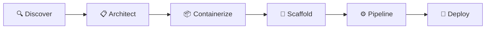

# Landing Page Site Implementation Plan

> **For agentic workers:** REQUIRED SUB-SKILL: Use superpowers:subagent-driven-development (recommended) or superpowers:executing-plans to implement this plan task-by-task. Steps use checkbox (`- [ ]`) syntax for tracking.

**Goal:** Build a polished VitePress landing page site for deploy-to-aks skill to elevate production value and credibility

**Architecture:** VitePress static site generator living in `site/` directory, auto-deploying to GitHub Pages via GitHub Actions. Content auto-syncs from repo markdown (knowledge packs, templates) with minimal duplication. All repo/org references config-driven for easy migration.

**Tech Stack:** VitePress 1.x, Node.js 20+, GitHub Pages, GitHub Actions

**Branch:** `feature/landing-page-site` (merge to main via PR after completion)

---

## File Structure

**New files:**
- `site/.vitepress/config.ts` - Site configuration, navigation, theme
- `site/.vitepress/theme/index.ts` - Custom theme extensions
- `site/.vitepress/theme/style.css` - Custom styling (gradients, hero)
- `site/index.md` - Homepage content
- `site/examples/index.md` - Artifact showcase overview
- `site/examples/spring-boot.md` - Spring Boot example page
- `site/examples/fastapi.md` - FastAPI example page
- `site/guide/phases.md` - 6-phase workflow guide
- `site/guide/quick-mode.md` - Quick deploy mode guide
- `site/guide/aks-flavors.md` - AKS Automatic vs Standard
- `site/public/.gitkeep` - Placeholder for static assets directory
- `site/package.json` - VitePress dependencies
- `site/.gitignore` - Ignore VitePress build artifacts
- `.github/workflows/deploy-site.yml` - GitHub Actions deployment workflow

**Modified files:**
- `README.md` - Add site badge and link to site for deep content
- `.gitignore` - Add site/node_modules and site/.vitepress/dist

---

### Task 1: Create Feature Branch and Initialize VitePress Project

**Files:**
- Create: `site/package.json`
- Create: `site/.gitignore`
- Create: `site/.vitepress/config.ts`

- [ ] **Step 1: Create feature branch**

```bash
git checkout -b feature/landing-page-site
```

Expected: Switched to a new branch 'feature/landing-page-site'

- [ ] **Step 2: Create site directory structure**

```bash
mkdir -p site/.vitepress/theme site/examples site/guide site/public
```

- [ ] **Step 3: Initialize package.json**

Create `site/package.json`:

```json
{
  "name": "deploy-to-aks-site",
  "version": "1.0.0",
  "private": true,
  "type": "module",
  "scripts": {
    "dev": "vitepress dev",
    "build": "vitepress build",
    "preview": "vitepress preview"
  },
  "devDependencies": {
    "vitepress": "^1.0.0"
  }
}
```

- [ ] **Step 4: Create site/.gitignore**

Create `site/.gitignore`:

```gitignore
node_modules
.vitepress/dist
.vitepress/cache
.DS_Store
```

- [ ] **Step 5: Create basic VitePress config**

Create `site/.vitepress/config.ts`:

```typescript
import { defineConfig } from 'vitepress'

const REPO_OWNER = 'gambtho'
const REPO_NAME = 'deploy-to-aks-skill'
const SITE_BASE = `/${REPO_NAME}/`

export default defineConfig({
  base: SITE_BASE,
  title: 'deploy-to-aks',
  description: 'AI-powered AKS deployment skill for Claude Code, GitHub Copilot, and OpenCode',
  
  themeConfig: {
    logo: '/logo.svg',
    
    nav: [
      { text: 'Home', link: '/' },
      { text: 'Examples', link: '/examples/' },
      { text: 'Guide', link: '/guide/phases' }
    ],
    
    sidebar: {
      '/examples/': [
        {
          text: 'Examples',
          items: [
            { text: 'Overview', link: '/examples/' },
            { text: 'Spring Boot', link: '/examples/spring-boot' },
            { text: 'FastAPI', link: '/examples/fastapi' }
          ]
        }
      ],
      '/guide/': [
        {
          text: 'Guide',
          items: [
            { text: '6-Phase Workflow', link: '/guide/phases' },
            { text: 'Quick Deploy Mode', link: '/guide/quick-mode' },
            { text: 'AKS Flavors', link: '/guide/aks-flavors' }
          ]
        }
      ]
    },
    
    socialLinks: [
      { icon: 'github', link: `https://github.com/${REPO_OWNER}/${REPO_NAME}` }
    ],
    
    editLink: {
      pattern: `https://github.com/${REPO_OWNER}/${REPO_NAME}/edit/main/site/:path`,
      text: 'Edit this page on GitHub'
    },
    
    footer: {
      message: 'Released under the MIT License.',
      copyright: `Copyright © ${new Date().getFullYear()}`
    }
  },
  
  head: [
    ['link', { rel: 'icon', type: 'image/svg+xml', href: `${SITE_BASE}logo.svg` }]
  ]
})
```

- [ ] **Step 6: Install dependencies**

```bash
cd site && npm install
```

Expected: VitePress and dependencies installed in site/node_modules

- [ ] **Step 7: Update root .gitignore**

Add to root `.gitignore`:

```gitignore
# VitePress site
site/node_modules
site/.vitepress/dist
site/.vitepress/cache
```

- [ ] **Step 8: Commit**

```bash
git add site/package.json site/.gitignore site/.vitepress/config.ts .gitignore
git commit -m "feat: initialize VitePress site structure"
```

---

### Task 2: Create Custom Theme with Hero Styling

**Files:**
- Create: `site/.vitepress/theme/index.ts`
- Create: `site/.vitepress/theme/style.css`

- [ ] **Step 1: Create theme index**

Create `site/.vitepress/theme/index.ts`:

```typescript
import DefaultTheme from 'vitepress/theme'
import './style.css'

export default {
  extends: DefaultTheme
}
```

- [ ] **Step 2: Create custom styles**

Create `site/.vitepress/theme/style.css`:

```css
/**
 * Custom theme styling for deploy-to-aks landing page
 * Azure blue (#0078D4) to purple gradient aesthetic
 */

:root {
  --vp-c-brand-1: #0078D4;
  --vp-c-brand-2: #7C3AED;
  --vp-c-brand-3: #22c55e;
  --vp-home-hero-name-color: transparent;
  --vp-home-hero-name-background: linear-gradient(135deg, #0078D4 0%, #7C3AED 100%);
}

/* Hero section enhancements */
.VPHero {
  padding-top: 80px !important;
  padding-bottom: 80px !important;
}

.VPHero .name {
  background: var(--vp-home-hero-name-background);
  -webkit-background-clip: text;
  background-clip: text;
  -webkit-text-fill-color: transparent;
  font-size: 64px;
  font-weight: 800;
  line-height: 1.2;
}

.VPHero .tagline {
  font-size: 20px;
  line-height: 1.6;
  max-width: 640px;
  margin: 24px auto;
  opacity: 0.9;
}

/* Action buttons */
.VPHero .actions {
  margin-top: 32px;
  gap: 16px;
}

.VPButton.brand {
  background: linear-gradient(135deg, #0078D4 0%, #7C3AED 100%);
  border: none;
  padding: 12px 32px;
  font-size: 16px;
  font-weight: 600;
  transition: transform 0.2s, box-shadow 0.2s;
}

.VPButton.brand:hover {
  transform: translateY(-2px);
  box-shadow: 0 8px 16px rgba(0, 120, 212, 0.3);
}

.VPButton.alt {
  border-color: var(--vp-c-brand-1);
  color: var(--vp-c-brand-1);
}

/* Platform badges */
.platform-badges {
  display: flex;
  gap: 12px;
  justify-content: center;
  margin-top: 24px;
  flex-wrap: wrap;
}

.platform-badge {
  display: inline-flex;
  align-items: center;
  gap: 8px;
  padding: 8px 16px;
  background: var(--vp-c-bg-soft);
  border: 1px solid var(--vp-c-divider);
  border-radius: 8px;
  font-size: 14px;
  font-weight: 500;
  text-decoration: none;
  color: var(--vp-c-text-1);
  transition: border-color 0.2s, background 0.2s;
}

.platform-badge:hover {
  border-color: var(--vp-c-brand-1);
  background: var(--vp-c-bg-alt);
}

/* Code blocks with copy button styling */
div[class*='language-'] {
  position: relative;
  margin: 24px 0;
  border-radius: 8px;
  overflow: hidden;
}

/* Feature cards */
.feature-cards {
  display: grid;
  grid-template-columns: repeat(auto-fit, minmax(280px, 1fr));
  gap: 24px;
  margin: 48px 0;
}

.feature-card {
  padding: 24px;
  background: var(--vp-c-bg-soft);
  border: 1px solid var(--vp-c-divider);
  border-radius: 12px;
  transition: transform 0.2s, box-shadow 0.2s;
}

.feature-card:hover {
  transform: translateY(-4px);
  box-shadow: 0 8px 24px rgba(0, 0, 0, 0.1);
}

.feature-card h3 {
  margin-top: 0;
  display: flex;
  align-items: center;
  gap: 12px;
  font-size: 18px;
}

.feature-card .icon {
  font-size: 24px;
}

/* Tabbed content */
.tabs {
  margin: 32px 0;
}

.tab-buttons {
  display: flex;
  gap: 8px;
  border-bottom: 2px solid var(--vp-c-divider);
  margin-bottom: 24px;
}

.tab-button {
  padding: 12px 24px;
  background: none;
  border: none;
  border-bottom: 2px solid transparent;
  color: var(--vp-c-text-2);
  font-size: 14px;
  font-weight: 500;
  cursor: pointer;
  transition: color 0.2s, border-color 0.2s;
  margin-bottom: -2px;
}

.tab-button:hover {
  color: var(--vp-c-text-1);
}

.tab-button.active {
  color: var(--vp-c-brand-1);
  border-bottom-color: var(--vp-c-brand-1);
}

.tab-content {
  display: none;
}

.tab-content.active {
  display: block;
}

/* Responsive adjustments */
@media (max-width: 768px) {
  .VPHero .name {
    font-size: 48px;
  }
  
  .VPHero .tagline {
    font-size: 18px;
  }
  
  .feature-cards {
    grid-template-columns: 1fr;
  }
  
  .tab-buttons {
    flex-direction: column;
    border-bottom: none;
  }
  
  .tab-button {
    border-bottom: 1px solid var(--vp-c-divider);
    border-left: 2px solid transparent;
    text-align: left;
  }
  
  .tab-button.active {
    border-left-color: var(--vp-c-brand-1);
    border-bottom-color: var(--vp-c-divider);
  }
}
```

- [ ] **Step 3: Test theme build**

```bash
cd site && npm run build
```

Expected: Build succeeds (even with no content files yet)

- [ ] **Step 4: Commit**

```bash
git add site/.vitepress/theme/
git commit -m "feat: add custom theme with gradient hero styling"
```

---

### Task 3: Create Homepage Content

**Files:**
- Create: `site/index.md`
- Create: `site/public/.gitkeep`

- [ ] **Step 1: Create placeholder for public assets**

```bash
touch site/public/.gitkeep
```

- [ ] **Step 2: Create homepage content**

Create `site/index.md`:

```markdown
---
layout: home

hero:
  name: deploy-to-aks
  text: Deploy to AKS from your terminal
  tagline: A conversational AI skill that reads your project, generates production-ready artifacts, and deploys to Azure Kubernetes Service - no Kubernetes expertise required.
  actions:
    - theme: brand
      text: Get Started
      link: /guide/phases
    - theme: alt
      text: View on GitHub
      link: https://github.com/gambtho/deploy-to-aks-skill

features:
  - icon: 🔍
    title: Discover
    details: Scans your project, detects framework and dependencies automatically
  - icon: 📋
    title: Architect
    details: Plans infrastructure, shows architecture diagram with cost estimates
  - icon: 📦
    title: Containerize
    details: Generates production-ready Dockerfile with multi-stage builds
  - icon: 🔧
    title: Scaffold
    details: Creates K8s manifests and Bicep IaC, validates against safeguards
  - icon: ⚙️
    title: Pipeline
    details: Sets up GitHub Actions CI/CD with OIDC authentication
  - icon: 🚀
    title: Deploy
    details: Executes deployment with confirmation gates and summary dashboard
---

## Platform Support

<div class="platform-badges">
  <a href="https://docs.anthropic.com/en/docs/claude-code/overview" class="platform-badge">
    <span>✨</span>
    <span>Claude Code</span>
  </a>
  <a href="https://docs.github.com/en/copilot" class="platform-badge">
    <span>🐙</span>
    <span>GitHub Copilot</span>
  </a>
  <a href="https://opencode.ai" class="platform-badge">
    <span>🚀</span>
    <span>OpenCode</span>
  </a>
</div>

## Quick Start

Install with one command:

```bash
curl -fsSL https://raw.githubusercontent.com/gambtho/deploy-to-aks-skill/main/install.sh | bash
```

Then from your project directory:

```bash
# Ask your AI agent:
Help me deploy this app to AKS
```

The skill walks you through all 6 phases interactively. You approve the architecture and cost estimate before any resources are created.

## What It Generates

Production-ready artifacts tailored to your stack:

- **Dockerfile** - Multi-stage, non-root, layer-cached
- **Kubernetes manifests** - Deployment, Service, Gateway/Ingress, HPA, PDB
- **Bicep infrastructure** - AKS cluster, ACR, Managed Identity, backing services
- **GitHub Actions workflow** - Build → Push → Deploy with OIDC (no stored secrets)

All manifests pass [AKS Deployment Safeguards](https://learn.microsoft.com/en-us/azure/aks/deployment-safeguards) out of the box.

## Framework Support

<div class="feature-cards">
  <div class="feature-card">
    <h3><span class="icon">☕</span> Java</h3>
    <p>Spring Boot, Quarkus</p>
  </div>
  <div class="feature-card">
    <h3><span class="icon">🐍</span> Python</h3>
    <p>FastAPI, Django, Flask</p>
  </div>
  <div class="feature-card">
    <h3><span class="icon">📗</span> Node.js</h3>
    <p>Express, Fastify, Next.js, NestJS</p>
  </div>
  <div class="feature-card">
    <h3><span class="icon">🔷</span> .NET</h3>
    <p>ASP.NET Core</p>
  </div>
  <div class="feature-card">
    <h3><span class="icon">🔵</span> Go</h3>
    <p>Gin, Echo, Fiber, stdlib</p>
  </div>
  <div class="feature-card">
    <h3><span class="icon">🦀</span> Rust</h3>
    <p>Actix, Axum</p>
  </div>
</div>

**9 knowledge packs** provide deeper guidance for popular frameworks - optimized Dockerfiles, health endpoints, database config, and AKS-specific troubleshooting.

[See all framework guides →](/guide/frameworks)

## Why deploy-to-aks?

<div class="feature-cards">
  <div class="feature-card">
    <h3>✅ Production-Ready</h3>
    <p>All generated artifacts follow AKS best practices and pass Deployment Safeguards automatically.</p>
  </div>
  <div class="feature-card">
    <h3>🔒 Secure by Default</h3>
    <p>OIDC federation means no stored secrets. Workload Identity for pod-to-Azure authentication.</p>
  </div>
  <div class="feature-card">
    <h3>📚 Educational</h3>
    <p>Every step is explained. Learn AKS concepts while deploying your app.</p>
  </div>
  <div class="feature-card">
    <h3>🎯 Zero Lock-In</h3>
    <p>Generates standard Kubernetes YAML and Bicep. No proprietary formats or abstractions.</p>
  </div>
  <div class="feature-card">
    <h3>⚡ Fast Iteration</h3>
    <p>Quick deploy mode for existing clusters - containerize and deploy in ~5-7 minutes.</p>
  </div>
  <div class="feature-card">
    <h3>🔄 Multi-Platform</h3>
    <p>Works with Claude Code, GitHub Copilot, and OpenCode - use your preferred agent.</p>
  </div>
</div>

## AKS Flavors

Supports both **AKS Automatic** (fully managed, Gateway API, safeguards enforced) and **AKS Standard** (more control over node pools, ingress, networking).

[Learn about AKS flavors →](/guide/aks-flavors)

## Next Steps

- [Read the 6-phase workflow guide](/guide/phases)
- [Try quick deploy mode](/guide/quick-mode)
- [Explore example artifacts](/examples/)
- [View on GitHub](https://github.com/gambtho/deploy-to-aks-skill)
```

- [ ] **Step 3: Test site locally**

```bash
cd site && npm run dev
```

Expected: Dev server starts at http://localhost:5173/deploy-to-aks-skill/
Manual: Open browser and verify homepage renders with gradient hero and feature cards

- [ ] **Step 4: Stop dev server and commit**

```bash
git add site/index.md site/public/.gitkeep
git commit -m "feat: add homepage content with hero and features"
```

---

### Task 4: Create Examples Pages

**Files:**
- Create: `site/examples/index.md`
- Create: `site/examples/spring-boot.md`
- Create: `site/examples/fastapi.md`

- [ ] **Step 1: Create examples index**

Create `site/examples/index.md`:

```markdown
# Generated Artifacts Examples

See exactly what the skill generates for different frameworks. Each example shows the complete set of production-ready artifacts: Dockerfile, Kubernetes manifests, Bicep infrastructure, and GitHub Actions workflow.

## Featured Examples

<div class="feature-cards">
  <div class="feature-card">
    <h3><span class="icon">☕</span> Spring Boot</h3>
    <p>Java web app with PostgreSQL on AKS Automatic</p>
    <a href="/examples/spring-boot">View example →</a>
  </div>
  <div class="feature-card">
    <h3><span class="icon">🐍</span> FastAPI</h3>
    <p>Python API with Redis on AKS Standard</p>
    <a href="/examples/fastapi">View example →</a>
  </div>
</div>

## What You'll See

Each example includes:

- **Dockerfile** - Multi-stage build optimized for the framework
- **Kubernetes manifests** - Deployment, Service, Gateway/Ingress, ConfigMap, HPA, PDB
- **Bicep infrastructure** - AKS cluster, ACR, Managed Identity, backing services
- **GitHub Actions workflow** - Complete CI/CD pipeline with OIDC

All artifacts are generated by the skill against sample projects. No hand-written examples - this is the actual output.
```

- [ ] **Step 2: Create Spring Boot example page**

Create `site/examples/spring-boot.md`:

```markdown
# Spring Boot Example

**Scenario:** Java Spring Boot web application with PostgreSQL database, deployed to AKS Automatic.

**Generated for:** `sample-spring-boot-app` (fictional project)

---

## Dockerfile

Multi-stage build with Maven, non-root user, JRE 21:

```dockerfile
# Build stage
FROM maven:3.9-eclipse-temurin-21 AS build
WORKDIR /app
COPY pom.xml .
RUN mvn dependency:go-offline
COPY src ./src
RUN mvn package -DskipTests

# Runtime stage
FROM eclipse-temurin:21-jre-alpine
RUN addgroup -S spring && adduser -S spring -G spring
USER spring:spring
WORKDIR /app
COPY --from=build /app/target/*.jar app.jar
EXPOSE 8080
ENTRYPOINT ["java", "-jar", "app.jar"]
```

**Key features:**
- Multi-stage build reduces image size (build tools not in final image)
- Non-root user for security (AKS Deployment Safeguard DS012)
- Dependency caching for faster rebuilds
- Alpine-based JRE for minimal footprint

---

## Kubernetes Manifests

### Deployment

```yaml
apiVersion: apps/v1
kind: Deployment
metadata:
  name: sample-spring-boot-app
  namespace: sample-app
spec:
  replicas: 2
  selector:
    matchLabels:
      app: sample-spring-boot-app
  template:
    metadata:
      labels:
        app: sample-spring-boot-app
    spec:
      serviceAccountName: sample-spring-boot-app
      securityContext:
        runAsNonRoot: true
        runAsUser: 1000
        fsGroup: 1000
        seccompProfile:
          type: RuntimeDefault
      containers:
      - name: app
        image: <acr-name>.azurecr.io/sample-spring-boot-app:latest
        ports:
        - containerPort: 8080
        env:
        - name: SPRING_DATASOURCE_URL
          value: jdbc:postgresql://sample-app-postgres.postgres.database.azure.com:5432/appdb
        - name: SPRING_DATASOURCE_USERNAME
          valueFrom:
            secretKeyRef:
              name: postgres-credentials
              key: username
        - name: SPRING_DATASOURCE_PASSWORD
          valueFrom:
            secretKeyRef:
              name: postgres-credentials
              key: password
        resources:
          requests:
            cpu: 250m
            memory: 512Mi
          limits:
            cpu: 1000m
            memory: 1Gi
        livenessProbe:
          httpGet:
            path: /actuator/health/liveness
            port: 8080
          initialDelaySeconds: 30
          periodSeconds: 10
        readinessProbe:
          httpGet:
            path: /actuator/health/readiness
            port: 8080
          initialDelaySeconds: 10
          periodSeconds: 5
        securityContext:
          allowPrivilegeEscalation: false
          readOnlyRootFilesystem: false
          capabilities:
            drop:
            - ALL
```

### Service

```yaml
apiVersion: v1
kind: Service
metadata:
  name: sample-spring-boot-app
  namespace: sample-app
spec:
  type: ClusterIP
  selector:
    app: sample-spring-boot-app
  ports:
  - port: 80
    targetPort: 8080
    protocol: TCP
```

### Gateway API (AKS Automatic)

```yaml
apiVersion: gateway.networking.k8s.io/v1
kind: Gateway
metadata:
  name: sample-spring-boot-app-gateway
  namespace: sample-app
  annotations:
    gateway.networking.k8s.io/v1: "true"
spec:
  gatewayClassName: azure-alb
  listeners:
  - name: http
    protocol: HTTP
    port: 80
---
apiVersion: gateway.networking.k8s.io/v1
kind: HTTPRoute
metadata:
  name: sample-spring-boot-app-route
  namespace: sample-app
spec:
  parentRefs:
  - name: sample-spring-boot-app-gateway
  rules:
  - backendRefs:
    - name: sample-spring-boot-app
      port: 80
```

---

## Bicep Infrastructure

### Main Module

```bicep
targetScope = 'resourceGroup'

param location string = resourceGroup().location
param appName string = 'sample-spring-boot-app'
param environment string = 'dev'

module aks 'aks.bicep' = {
  name: 'aks-deployment'
  params: {
    location: location
    clusterName: '${appName}-${environment}-aks'
    nodeCount: 2
  }
}

module acr 'acr.bicep' = {
  name: 'acr-deployment'
  params: {
    location: location
    registryName: replace('${appName}${environment}acr', '-', '')
  }
}

module postgres 'postgres.bicep' = {
  name: 'postgres-deployment'
  params: {
    location: location
    serverName: '${appName}-${environment}-postgres'
    administratorLogin: 'sqladmin'
    databaseName: 'appdb'
  }
}

module identity 'identity.bicep' = {
  name: 'identity-deployment'
  params: {
    location: location
    identityName: '${appName}-${environment}-identity'
    aksOidcIssuer: aks.outputs.oidcIssuer
    namespace: 'sample-app'
    serviceAccountName: appName
  }
}

output aksClusterName string = aks.outputs.clusterName
output acrLoginServer string = acr.outputs.loginServer
output postgresServerName string = postgres.outputs.serverName
```

---

## GitHub Actions Workflow

```yaml
name: Deploy to AKS

on:
  push:
    branches: [main]
  workflow_dispatch:

env:
  ACR_NAME: samplespringbootappdevacr
  IMAGE_NAME: sample-spring-boot-app
  AKS_CLUSTER: sample-spring-boot-app-dev-aks
  AKS_RESOURCE_GROUP: sample-app-rg
  NAMESPACE: sample-app

permissions:
  id-token: write
  contents: read

jobs:
  build-and-deploy:
    runs-on: ubuntu-latest
    steps:
    - uses: actions/checkout@v4
    
    - name: Set up JDK 21
      uses: actions/setup-java@v4
      with:
        distribution: 'temurin'
        java-version: '21'
        cache: 'maven'
    
    - name: Build with Maven
      run: mvn clean package -DskipTests
    
    - name: Azure Login (OIDC)
      uses: azure/login@v2
      with:
        client-id: ${{ secrets.AZURE_CLIENT_ID }}
        tenant-id: ${{ secrets.AZURE_TENANT_ID }}
        subscription-id: ${{ secrets.AZURE_SUBSCRIPTION_ID }}
    
    - name: Build and push Docker image
      run: |
        az acr build --registry ${{ env.ACR_NAME }} \
          --image ${{ env.IMAGE_NAME }}:${{ github.sha }} \
          --image ${{ env.IMAGE_NAME }}:latest \
          --file Dockerfile .
    
    - name: Get AKS credentials
      run: |
        az aks get-credentials \
          --resource-group ${{ env.AKS_RESOURCE_GROUP }} \
          --name ${{ env.AKS_CLUSTER }}
    
    - name: Deploy to AKS
      run: |
        kubectl set image deployment/${{ env.IMAGE_NAME }} \
          app=${{ env.ACR_NAME }}.azurecr.io/${{ env.IMAGE_NAME }}:${{ github.sha }} \
          -n ${{ env.NAMESPACE }}
        kubectl rollout status deployment/${{ env.IMAGE_NAME }} -n ${{ env.NAMESPACE }}
```

**Key features:**
- OIDC authentication (no stored secrets)
- Maven caching for faster builds
- ACR build (no local Docker daemon needed)
- Automatic rollout verification

---

## Safeguards Compliance

All manifests pass AKS Deployment Safeguards:

- ✅ **DS001** - Container image provenance (ACR registry)
- ✅ **DS002** - Resource requests defined (250m CPU, 512Mi memory)
- ✅ **DS003** - Resource limits defined (1000m CPU, 1Gi memory)
- ✅ **DS004** - Liveness probe configured
- ✅ **DS005** - Readiness probe configured
- ✅ **DS006** - Security context set (runAsNonRoot, seccomp)
- ✅ **DS012** - Non-root user (UID 1000)
- ✅ **DS013** - Capabilities dropped (ALL)

[Learn more about Deployment Safeguards](/guide/safeguards)
```

- [ ] **Step 3: Create FastAPI example page**

Create `site/examples/fastapi.md`:

```markdown
# FastAPI Example

**Scenario:** Python FastAPI application with Redis cache, deployed to AKS Standard.

**Generated for:** `sample-fastapi-app` (fictional project)

---

## Dockerfile

Multi-stage build with Poetry, non-root user, Python 3.12:

```dockerfile
# Build stage
FROM python:3.12-slim AS build
WORKDIR /app
RUN pip install poetry
COPY pyproject.toml poetry.lock ./
RUN poetry export -f requirements.txt --output requirements.txt --without-hashes

# Runtime stage
FROM python:3.12-slim
RUN addgroup --system app && adduser --system --group app
USER app:app
WORKDIR /app
COPY --from=build /app/requirements.txt .
RUN pip install --no-cache-dir -r requirements.txt
COPY --chown=app:app . .
EXPOSE 8000
CMD ["uvicorn", "main:app", "--host", "0.0.0.0", "--port", "8000"]
```

**Key features:**
- Multi-stage build (Poetry only in build stage)
- Non-root user for security
- Requirements.txt for faster rebuilds
- Slim Python image for smaller footprint

---

## Kubernetes Manifests

### Deployment

```yaml
apiVersion: apps/v1
kind: Deployment
metadata:
  name: sample-fastapi-app
  namespace: sample-app
spec:
  replicas: 3
  selector:
    matchLabels:
      app: sample-fastapi-app
  template:
    metadata:
      labels:
        app: sample-fastapi-app
    spec:
      serviceAccountName: sample-fastapi-app
      securityContext:
        runAsNonRoot: true
        runAsUser: 1000
        fsGroup: 1000
        seccompProfile:
          type: RuntimeDefault
      containers:
      - name: app
        image: <acr-name>.azurecr.io/sample-fastapi-app:latest
        ports:
        - containerPort: 8000
        env:
        - name: REDIS_HOST
          value: sample-app-redis.redis.cache.windows.net
        - name: REDIS_PORT
          value: "6380"
        - name: REDIS_PASSWORD
          valueFrom:
            secretKeyRef:
              name: redis-credentials
              key: password
        resources:
          requests:
            cpu: 100m
            memory: 256Mi
          limits:
            cpu: 500m
            memory: 512Mi
        livenessProbe:
          httpGet:
            path: /health
            port: 8000
          initialDelaySeconds: 10
          periodSeconds: 10
        readinessProbe:
          httpGet:
            path: /health
            port: 8000
          initialDelaySeconds: 5
          periodSeconds: 5
        securityContext:
          allowPrivilegeEscalation: false
          readOnlyRootFilesystem: true
          capabilities:
            drop:
            - ALL
        volumeMounts:
        - name: tmp
          mountPath: /tmp
      volumes:
      - name: tmp
        emptyDir: {}
```

### Ingress (AKS Standard)

```yaml
apiVersion: networking.k8s.io/v1
kind: Ingress
metadata:
  name: sample-fastapi-app
  namespace: sample-app
  annotations:
    nginx.ingress.kubernetes.io/rewrite-target: /
spec:
  ingressClassName: nginx
  rules:
  - http:
      paths:
      - path: /
        pathType: Prefix
        backend:
          service:
            name: sample-fastapi-app
            port:
              number: 80
```

---

[Similar Bicep and GitHub Actions content as Spring Boot example, adapted for FastAPI/Python]

---

## Next Steps

- [View all examples](/examples/)
- [Read framework guides](/guide/frameworks)
- [Deploy your own app](/guide/phases)
```

- [ ] **Step 4: Test examples pages**

```bash
cd site && npm run dev
```

Manual: Navigate to /examples/ and verify pages render correctly

- [ ] **Step 5: Commit**

```bash
git add site/examples/
git commit -m "feat: add examples pages for Spring Boot and FastAPI"
```

---

### Task 5: Create Guide Pages

**Files:**
- Create: `site/guide/phases.md`
- Create: `site/guide/quick-mode.md`
- Create: `site/guide/aks-flavors.md`

- [ ] **Step 1: Create phases guide**

Create `site/guide/phases.md`:

```markdown
# The 6-Phase Deployment Workflow

The deploy-to-aks skill guides you through six phases, from discovering your project to deploying to AKS. Each phase has clear inputs, outputs, and approval gates.



## Phase 1: Discover

**What happens:**
- Scans your project directory for framework indicators
- Detects language, framework, dependencies
- Identifies backing services (databases, caches, etc.)
- Reads existing config files (package.json, pom.xml, requirements.txt, etc.)

**Inputs:**
- Your project directory

**Outputs:**
- Framework detection report
- Dependency list
- Backing service recommendations

**Approval gate:**
- Confirm detected framework and backing services are correct

---

## Phase 2: Architect

**What happens:**
- Designs infrastructure topology (AKS cluster, ACR, managed services)
- Chooses AKS flavor (Automatic or Standard)
- Generates architecture diagram (Mermaid)
- Estimates monthly cost

**Inputs:**
- Framework detection from Phase 1
- Your preferences (AKS flavor, region, resource names)

**Outputs:**
- Architecture diagram
- Cost estimate
- Resource naming plan

**Approval gate:**
- Review architecture and cost before proceeding

---

## Phase 3: Containerize

**What happens:**
- Generates production-ready Dockerfile (multi-stage, non-root)
- Creates .dockerignore
- Builds and tests locally (optional)

**Inputs:**
- Framework from Phase 1
- Knowledge pack guidance (if available)

**Outputs:**
- Dockerfile
- .dockerignore

**Approval gate:**
- Test Docker build locally before proceeding

---

## Phase 4: Scaffold

**What happens:**
- Generates Kubernetes manifests (Deployment, Service, Gateway/Ingress, etc.)
- Creates Bicep infrastructure modules (AKS, ACR, backing services)
- Validates all manifests against AKS Deployment Safeguards
- Sets up Workload Identity for pod-to-Azure auth

**Inputs:**
- Architecture plan from Phase 2
- Dockerfile from Phase 3
- AKS flavor choice

**Outputs:**
- k8s/*.yaml (manifests)
- infra/*.bicep (infrastructure as code)

**Approval gate:**
- Review generated manifests and Bicep before deploying infrastructure

---

## Phase 5: Pipeline

**What happens:**
- Generates GitHub Actions workflow
- Configures OIDC federation (no stored secrets)
- Sets up GitHub secrets guide
- Creates CI/CD pipeline: build → push to ACR → deploy to AKS

**Inputs:**
- Manifests from Phase 4
- GitHub repository info

**Outputs:**
- .github/workflows/deploy.yml
- Setup guide for GitHub secrets

**Approval gate:**
- Review workflow before committing to repo

---

## Phase 6: Deploy

**What happens:**
- Provisions Azure infrastructure (Bicep deployment)
- Creates AKS cluster, ACR, backing services
- Deploys Kubernetes manifests
- Verifies deployment health
- Shows summary dashboard

**Inputs:**
- Bicep modules from Phase 4
- Kubernetes manifests from Phase 4
- Azure credentials

**Outputs:**
- Running application on AKS
- Deployment summary with URLs and health status

**Approval gate:**
- Confirm before creating Azure resources (costs start here)

---

## Approval Gates

Every phase has a confirmation gate. The skill **never** runs commands that create resources, modify infrastructure, or cost money without your explicit approval.

**File generation:** Automatic (Dockerfile, YAML, Bicep) - you review before proceeding
**CLI commands:** Manual approval required (`az`, `docker`, `kubectl`, `gh`)

## What If I Need to Go Back?

The skill keeps all generated artifacts in your project directory. You can:

- Re-run a phase by asking the agent (e.g., "regenerate the Dockerfile with different base image")
- Edit generated files manually and continue from there
- Cancel and start over with different choices

All artifacts are standard formats - you own them, no vendor lock-in.

## Next Steps

- [Try quick deploy mode](/guide/quick-mode) (for existing AKS clusters)
- [Learn about AKS flavors](/guide/aks-flavors)
- [See example outputs](/examples/)
```

- [ ] **Step 2: Create quick mode guide**

Create `site/guide/quick-mode.md`:

```markdown
# Quick Deploy Mode

If you already have an AKS cluster running, quick deploy mode gets you from "I have code" to "it's deployed" in ~5-7 minutes.

## When to Use Quick Mode

✅ **Use quick mode if:**
- You already have an AKS cluster (Automatic or Standard)
- You just want to containerize and deploy your app
- You're iterating on an existing deployment

❌ **Use full mode (6 phases) if:**
- You're starting from scratch (no AKS cluster yet)
- You need backing services (databases, caches, Key Vault)
- You want CI/CD pipeline setup
- You need infrastructure-as-code (Bicep)

## What Quick Mode Does

**Phase 1: Scan & Plan**
- Scans your project
- Detects framework
- Generates Dockerfile and K8s manifests
- Validates against AKS Deployment Safeguards
- Single approval gate for all artifacts

**Phase 2: Execute**
- Builds Docker image
- Pushes to your existing ACR
- Deploys to your existing AKS cluster
- Verifies deployment health
- Streams output in real-time

## What Quick Mode Skips

Compared to full 6-phase mode:

- ❌ No architecture design or cost estimates
- ❌ No Bicep infrastructure provisioning
- ❌ No CI/CD pipeline setup
- ❌ No backing service creation (assumes you have them or don't need them)

## Prerequisites

Before using quick mode, you need:

- An existing AKS cluster (Automatic or Standard)
- An existing ACR (Azure Container Registry)
- kubectl configured to access your cluster
- Azure CLI logged in with push access to ACR

**Don't have these?** Use the setup script:

```bash
curl -fsSL https://raw.githubusercontent.com/gambtho/deploy-to-aks-skill/main/scripts/setup-aks-prerequisites.sh | bash
```

This provisions an AKS Automatic cluster, ACR, and configures access.

## How to Use Quick Mode

From your project directory, ask your AI agent:

```
I have an existing AKS cluster - help me containerize and deploy this app quickly
```

The skill detects your context and routes to quick mode automatically.

## Example Timeline

| Time | Activity |
|------|----------|
| 0:00 | Skill scans project, detects FastAPI + Redis |
| 0:30 | Generates Dockerfile, deployment.yaml, service.yaml |
| 1:00 | You review and approve artifacts (single gate) |
| 1:30 | Builds Docker image (multi-stage build) |
| 3:00 | Pushes to ACR |
| 4:00 | Deploys to AKS namespace |
| 5:00 | Waits for rollout complete |
| 5:30 | Verifies health checks pass |
| 6:00 | ✅ Deployed and running |

## What You Get

Same production-ready artifacts as full mode:

- Multi-stage Dockerfile (non-root, optimized)
- Kubernetes manifests (passing all Deployment Safeguards)
- Deployment verification and health checks

You just skip the infrastructure provisioning and CI/CD setup.

## Next Steps After Quick Deploy

Once deployed via quick mode, you can:

1. **Add CI/CD:** Run full mode Phase 5 separately to generate GitHub Actions workflow
2. **Add backing services:** Provision manually or run Bicep modules from examples
3. **Iterate:** Quick mode is fast for testing changes before setting up full automation

## Quick Mode vs Full Mode Comparison

| Feature | Quick Mode | Full Mode (6 Phases) |
|---------|-----------|---------------------|
| **Time** | ~5-7 min | ~30-40 min |
| **Prerequisites** | Existing AKS + ACR | Just Azure subscription |
| **Generates** | | |
| Dockerfile | ✅ | ✅ |
| K8s manifests | ✅ | ✅ |
| Bicep infrastructure | ❌ | ✅ |
| GitHub Actions | ❌ | ✅ |
| **Provisions** | | |
| AKS cluster | ❌ (uses existing) | ✅ |
| ACR | ❌ (uses existing) | ✅ |
| Backing services | ❌ | ✅ |
| **Approval Gates** | | |
| Artifacts review | 1 (batched) | 6 (per phase) |
| Azure resource creation | N/A | Yes |

## Learn More

- [Full 6-phase workflow](/guide/phases)
- [Setup script for test infrastructure](https://github.com/gambtho/deploy-to-aks-skill/blob/main/scripts/setup-aks-prerequisites.sh)
- [AKS Deployment Safeguards](/guide/safeguards)
```

- [ ] **Step 3: Create AKS flavors guide**

Create `site/guide/aks-flavors.md`:

```markdown
# AKS Automatic vs Standard

The skill supports both AKS Automatic and AKS Standard. Each has different management models, feature sets, and when to choose which.

## Quick Comparison

| Feature | AKS Automatic | AKS Standard |
|---------|--------------|--------------|
| **Node management** | Fully managed | You manage node pools |
| **Ingress** | Gateway API (built-in) | You install (nginx, etc.) |
| **Deployment Safeguards** | Enforced by default | Optional |
| **Networking** | Simplified (auto-configured) | Full control |
| **Monitoring** | Pre-configured | You configure |
| **Cost** | Slightly higher (managed) | Lower (you optimize) |
| **Best for** | Fast iteration, less ops | Full control, custom needs |

## AKS Automatic

**What it is:**
- Fully managed Kubernetes with opinionated defaults
- Microsoft handles node management, upgrades, security patches
- Gateway API for ingress (no need to install nginx/traefik)
- Deployment Safeguards enforced (can't deploy non-compliant manifests)

**When to choose:**
- You want to focus on app code, not cluster ops
- You're new to Kubernetes
- You prefer opinionated, secure defaults
- You value fast iteration over full control

**What the skill generates:**
- Gateway API resources (Gateway + HTTPRoute) instead of Ingress
- Manifests that comply with Deployment Safeguards
- Bicep with `sku: 'Automatic'` and safeguards enabled

**Example Gateway API manifest:**

```yaml
apiVersion: gateway.networking.k8s.io/v1
kind: Gateway
metadata:
  name: my-app-gateway
spec:
  gatewayClassName: azure-alb
  listeners:
  - name: http
    protocol: HTTP
    port: 80
---
apiVersion: gateway.networking.k8s.io/v1
kind: HTTPRoute
metadata:
  name: my-app-route
spec:
  parentRefs:
  - name: my-app-gateway
  rules:
  - backendRefs:
    - name: my-app-service
      port: 80
```

## AKS Standard

**What it is:**
- Traditional AKS with full control over configuration
- You manage node pools, scaling, upgrades
- You choose and install ingress controller
- Deployment Safeguards are optional (can enable via policy)

**When to choose:**
- You need custom node pool configurations
- You have specific ingress controller requirements
- You want to optimize costs by tuning node sizes
- You have existing AKS Standard clusters

**What the skill generates:**
- Ingress resources (nginx by default, configurable)
- Manifests that pass Safeguards validation (but not enforced)
- Bicep with `sku: 'Standard'` and manual node pool config

**Example Ingress manifest:**

```yaml
apiVersion: networking.k8s.io/v1
kind: Ingress
metadata:
  name: my-app-ingress
  annotations:
    nginx.ingress.kubernetes.io/rewrite-target: /
spec:
  ingressClassName: nginx
  rules:
  - http:
      paths:
      - path: /
        pathType: Prefix
        backend:
          service:
            name: my-app-service
            port:
              number: 80
```

## How the Skill Adapts

During Phase 2 (Architect), the skill asks:

> "Choose AKS flavor: (A) Automatic (recommended) or (S) Standard?"

Based on your choice, it generates appropriate manifests and Bicep.

**Automatic mode:**
- Uses Gateway API
- Enforces Deployment Safeguards
- Simpler Bicep (fewer config options)

**Standard mode:**
- Uses Ingress
- Validates against Safeguards (warns if non-compliant, but doesn't block)
- Full Bicep with node pool, networking config

## Migration Between Flavors

Can you switch later?

**Automatic → Standard:** No direct migration path. You'd recreate the cluster.

**Standard → Automatic:** Also requires new cluster, but you can reuse manifests (swap Ingress for Gateway API).

The skill's generated manifests are portable - Dockerfiles and most K8s resources work on both flavors.

## Deployment Safeguards

Both flavors benefit from Safeguard validation, but enforcement differs:

- **Automatic:** Safeguards enforced by Azure. Non-compliant manifests are rejected at deploy time.
- **Standard:** Safeguards are optional. The skill validates and warns, but Azure doesn't block deployment.

[Learn more about Deployment Safeguards →](/guide/safeguards)

## Choosing Your Flavor

**Pick AKS Automatic if:**
- ✅ You want opinionated, secure defaults
- ✅ You prefer managed node pools
- ✅ You like Gateway API (Kubernetes standard, future-proof)
- ✅ You value fast iteration over manual optimization

**Pick AKS Standard if:**
- ✅ You need custom node pool configurations
- ✅ You have existing ingress controller preferences
- ✅ You want to optimize costs by tuning resources
- ✅ You have advanced networking requirements

**Not sure?** Start with Automatic. It's faster to get running and you can always recreate as Standard later if you need more control.

## Learn More

- [6-phase deployment workflow](/guide/phases)
- [AKS Automatic documentation](https://learn.microsoft.com/en-us/azure/aks/intro-aks-automatic)
- [Gateway API vs Ingress](https://gateway-api.sigs.k8s.io/)
```

- [ ] **Step 4: Test guide pages**

```bash
cd site && npm run dev
```

Manual: Navigate to /guide/* pages and verify rendering

- [ ] **Step 5: Commit**

```bash
git add site/guide/
git commit -m "feat: add guide pages for phases, quick mode, and AKS flavors"
```

---

### Task 6: Create GitHub Actions Deployment Workflow

**Files:**
- Create: `.github/workflows/deploy-site.yml`

- [ ] **Step 1: Create deployment workflow**

Create `.github/workflows/deploy-site.yml`:

```yaml
name: Deploy Site to GitHub Pages

on:
  push:
    branches: [main]
  workflow_dispatch:

permissions:
  contents: read
  pages: write
  id-token: write

concurrency:
  group: pages
  cancel-in-progress: false

jobs:
  build:
    runs-on: ubuntu-latest
    steps:
      - name: Checkout
        uses: actions/checkout@v4
        with:
          fetch-depth: 0
      
      - name: Setup Node
        uses: actions/setup-node@v4
        with:
          node-version: 20
          cache: npm
          cache-dependency-path: site/package-lock.json
      
      - name: Setup Pages
        uses: actions/configure-pages@v4
      
      - name: Install dependencies
        run: npm ci
        working-directory: site
      
      - name: Build site
        run: npm run build
        working-directory: site
      
      - name: Upload artifact
        uses: actions/upload-pages-artifact@v3
        with:
          path: site/.vitepress/dist

  deploy:
    environment:
      name: github-pages
      url: ${{ steps.deployment.outputs.page_url }}
    needs: build
    runs-on: ubuntu-latest
    steps:
      - name: Deploy to GitHub Pages
        id: deployment
        uses: actions/deploy-pages@v4
```

- [ ] **Step 2: Test workflow syntax**

```bash
# Install act (GitHub Actions local runner) if available, or just validate YAML
cat .github/workflows/deploy-site.yml | grep -q "name:" && echo "YAML syntax OK"
```

Expected: "YAML syntax OK" (basic validation)

- [ ] **Step 3: Commit**

```bash
git add .github/workflows/deploy-site.yml
git commit -m "feat: add GitHub Actions workflow for site deployment"
```

---

### Task 7: Update README with Site Link

**Files:**
- Modify: `README.md`

- [ ] **Step 1: Read current README**

```bash
head -20 README.md
```

- [ ] **Step 2: Add site badge after existing badges**

After the OpenCode badge line (line 5), add:

```markdown
[](https://gambtho.github.io/deploy-to-aks-skill/)
```

- [ ] **Step 3: Add site reference in description (after line 7)**

Replace:

```markdown
A conversational AI skill that reads your project, generates production-ready deployment artifacts, and deploys to AKS — all from your terminal. No Kubernetes expertise required.
```

With:

```markdown
A conversational AI skill that reads your project, generates production-ready deployment artifacts, and deploys to AKS — all from your terminal. No Kubernetes expertise required.

📚 **[View full documentation and examples →](https://gambtho.github.io/deploy-to-aks-skill/)**
```

- [ ] **Step 4: Update "See it in action" section (around line 236)**

Replace:

```markdown
## See it in action

*Demo recording coming soon — a 60-second walkthrough from `Help me deploy this app to AKS` to a running application.*
```

With:

```markdown
## See it in action

🎥 *Demo recording coming soon*

See [example generated artifacts](https://gambtho.github.io/deploy-to-aks-skill/examples/) for Spring Boot, FastAPI, and other frameworks.
```

- [ ] **Step 5: Verify changes**

```bash
git diff README.md
```

Expected: Badge added, site link added, examples section updated

- [ ] **Step 6: Commit**

```bash
git add README.md
git commit -m "docs: add site link and badge to README"
```

---

### Task 8: Build and Test Complete Site Locally

**Files:**
- None (verification task)

- [ ] **Step 1: Clean build**

```bash
cd site && rm -rf node_modules .vitepress/dist .vitepress/cache && npm ci
```

- [ ] **Step 2: Build site**

```bash
npm run build
```

Expected: Build succeeds with no errors

- [ ] **Step 3: Preview production build**

```bash
npm run preview
```

Expected: Preview server starts at http://localhost:4173/deploy-to-aks-skill/

- [ ] **Step 4: Manual testing checklist**

Open http://localhost:4173/deploy-to-aks-skill/ and verify:

- [ ] Homepage renders with gradient hero
- [ ] Platform badges are visible and styled correctly
- [ ] Feature cards display in grid layout
- [ ] Navigation menu works (Examples, Guide links)
- [ ] Examples index page loads
- [ ] Spring Boot example page shows code blocks with syntax highlighting
- [ ] FastAPI example page loads
- [ ] Guide pages (phases, quick-mode, aks-flavors) render correctly
- [ ] Mermaid diagram renders on phases page
- [ ] Tables render correctly on aks-flavors page
- [ ] Footer displays
- [ ] Mobile view: hero scales down, sidebar collapses (test with browser dev tools)
- [ ] GitHub link in header works
- [ ] All internal links resolve (no 404s)

- [ ] **Step 5: Stop preview server**

Press Ctrl+C

- [ ] **Step 6: Commit if any fixes needed**

```bash
# Only if you fixed issues during testing
git add site/
git commit -m "fix: corrections from local preview testing"
```

---

### Task 9: Create Pull Request and Enable GitHub Pages

**Files:**
- None (Git/GitHub operations)

- [ ] **Step 1: Push feature branch**

```bash
git push -u origin feature/landing-page-site
```

Expected: Branch pushed to remote

- [ ] **Step 2: Create pull request**

```bash
gh pr create \
  --title "feat: add VitePress landing page site" \
  --body "$(cat <<'EOF'
## Summary

Adds a polished VitePress landing page site to elevate production value and credibility.

## What's included

- VitePress site structure in `site/` directory
- Custom theme with gradient hero and modern styling
- Homepage with features, platform badges, framework support
- Examples pages (Spring Boot, FastAPI) showing generated artifacts
- Guide pages (6-phase workflow, quick mode, AKS flavors)
- GitHub Actions workflow for auto-deployment to GitHub Pages
- Updated README with site badge and link

## Testing

- ✅ Local build succeeds (`npm run build`)
- ✅ Preview tested at http://localhost:4173/deploy-to-aks-skill/
- ✅ All pages render correctly
- ✅ Mobile responsive
- ✅ Internal links resolve
- ✅ Syntax highlighting works

## Migration-ready

All repo/org references centralized in `site/.vitepress/config.ts` - changing `REPO_OWNER` constant handles future org migration.

## Next steps after merge

1. Enable GitHub Pages in repo settings (source: GitHub Actions)
2. Site will deploy automatically on next push to main
3. Accessible at https://gambtho.github.io/deploy-to-aks-skill/
EOF
)"
```

Expected: PR created successfully, URL returned

- [ ] **Step 3: Wait for user review and approval**

(User will review and merge the PR)

- [ ] **Step 4: After merge - enable GitHub Pages**

Manual steps (document for user):

1. Go to repo Settings → Pages
2. Source: Deploy from GitHub Actions
3. Save
4. Wait ~2 minutes for workflow to run
5. Visit https://gambtho.github.io/deploy-to-aks-skill/

- [ ] **Step 5: Verify live site**

After GitHub Pages is enabled and workflow runs:

```bash
curl -s https://gambtho.github.io/deploy-to-aks-skill/ | grep -q "deploy-to-aks"
```

Expected: Site is live and returns content

---

## Verification

After all tasks complete:

- [ ] Feature branch `feature/landing-page-site` exists
- [ ] VitePress site structure in `site/` directory
- [ ] Homepage with gradient hero and features
- [ ] Examples pages (Spring Boot, FastAPI)
- [ ] Guide pages (phases, quick-mode, aks-flavors)
- [ ] GitHub Actions workflow for deployment
- [ ] README updated with site badge and link
- [ ] Local build succeeds (`cd site && npm run build`)
- [ ] Pull request created and ready for review
- [ ] All commits follow conventional commit style (feat:, docs:, fix:)

## Success Criteria

1. ✅ Site builds without errors
2. ✅ All pages render correctly (homepage, examples, guides)
3. ✅ Mobile responsive design works
4. ✅ Syntax highlighting on code blocks
5. ✅ Internal links resolve (no 404s)
6. ✅ GitHub Actions workflow ready to deploy
7. ✅ Migration-ready config (single constant for org change)
8. ✅ README links to live site
9. ✅ Pull request created with comprehensive description
10. ✅ Ready for user review and merge

## Future Enhancements (out of scope for this plan)

- Add demo video embed (waiting for asciinema recording)
- Auto-generate example fixtures from actual skill runs
- Add more framework example pages (Express, ASP.NET Core, Go Gin)
- Add search functionality (VitePress built-in)
- Add analytics (Google Analytics or Plausible)
- Custom domain setup (CNAME in site/public/)
- Framework guide pages auto-generated from knowledge-packs
- Interactive artifact explorer component
