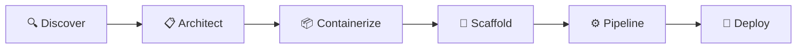

# The 6-Phase Deployment Workflow

The deploy-to-aks skill guides you through six phases, from discovering your project to deploying to AKS. Each phase has clear inputs, outputs, and approval gates.

## Phase 1: Discover

**What happens:**
- Scans your project directory for framework indicators
- Detects language, framework, dependencies
- Identifies backing services (databases, caches, etc.)
- Reads existing config files (package.json, pom.xml, requirements.txt, etc.)

**Inputs:**
- Your project directory

**Outputs:**
- Framework detection report
- Dependency list
- Backing service recommendations

**Approval gate:**
- Confirm detected framework and backing services are correct

---

## Phase 2: Architect

**What happens:**
- Designs infrastructure topology (AKS cluster, ACR, managed services)
- Chooses AKS flavor (Automatic or Standard)
- Generates architecture diagram (Mermaid)
- Estimates monthly cost

**Inputs:**
- Framework detection from Phase 1
- Your preferences (AKS flavor, region, resource names)

**Outputs:**
- Architecture diagram
- Cost estimate
- Resource naming plan

**Approval gate:**
- Review architecture and cost before proceeding

---

## Phase 3: Containerize

**What happens:**
- Generates production-ready Dockerfile (multi-stage, non-root)
- Creates .dockerignore
- Builds and tests locally (optional)

**Inputs:**
- Framework from Phase 1
- Knowledge pack guidance (if available)

**Outputs:**
- Dockerfile
- .dockerignore

**Approval gate:**
- Test Docker build locally before proceeding

---

## Phase 4: Scaffold

**What happens:**
- Generates Kubernetes manifests (Deployment, Service, Gateway/Ingress, etc.)
- Creates Bicep infrastructure modules (AKS, ACR, backing services)
- Validates all manifests against AKS Deployment Safeguards
- Sets up Workload Identity for pod-to-Azure auth

**Inputs:**
- Architecture plan from Phase 2
- Dockerfile from Phase 3
- AKS flavor choice

**Outputs:**
- k8s/*.yaml (manifests)
- infra/*.bicep (infrastructure as code)

**Approval gate:**
- Review generated manifests and Bicep before deploying infrastructure

---

## Phase 5: Pipeline

**What happens:**
- Generates GitHub Actions workflow
- Configures OIDC federation (no stored secrets)
- Sets up GitHub secrets guide
- Creates CI/CD pipeline: build → push to ACR → deploy to AKS

**Inputs:**
- Manifests from Phase 4
- GitHub repository info

**Outputs:**
- .github/workflows/deploy.yml
- Setup guide for GitHub secrets

**Approval gate:**
- Review workflow before committing to repo

---

## Phase 6: Deploy

**What happens:**
- Provisions Azure infrastructure (Bicep deployment)
- Creates AKS cluster, ACR, backing services
- Deploys Kubernetes manifests
- Verifies deployment health
- Shows summary dashboard

**Inputs:**
- Bicep modules from Phase 4
- Kubernetes manifests from Phase 4
- Azure credentials

**Outputs:**
- Running application on AKS
- Deployment summary with URLs and health status

**Approval gate:**
- Confirm before creating Azure resources (costs start here)

---

## Approval Gates

Every phase has a confirmation gate. The skill **never** runs commands that create resources, modify infrastructure, or cost money without your explicit approval.

**File generation:** Automatic (Dockerfile, YAML, Bicep) - you review before proceeding
**CLI commands:** Manual approval required (`az`, `docker`, `kubectl`, `gh`)

## What If I Need to Go Back?

The skill keeps all generated artifacts in your project directory. You can:

- Re-run a phase by asking the agent (e.g., "regenerate the Dockerfile with different base image")
- Edit generated files manually and continue from there
- Cancel and start over with different choices

All artifacts are standard formats - you own them, no vendor lock-in.

## Next Steps

- [Try quick deploy mode](/guide/quick-mode) (for existing AKS clusters)
- [Learn about AKS flavors](/guide/aks-flavors)
- [See example outputs](/examples/)
