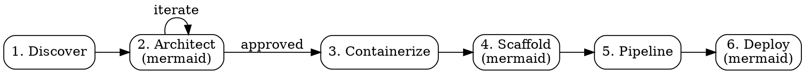

# Deploy to AKS

Guide developers through deploying applications to Azure Kubernetes Service (AKS) without requiring Kubernetes expertise. Reads the actual project, detects the framework, generates production-ready artifacts, and optionally executes the deployment.

## Checklist

You MUST track each of these items as a checklist and complete them in order:

1. **Discover** -- scan the project, detect framework/language/dependencies, ask clarifying questions
2. **Architect** -- plan infrastructure, show architecture diagram + cost estimate, get approval
3. **Containerize** -- generate or validate Dockerfile + .dockerignore
4. **Scaffold** -- generate K8s manifests + Bicep IaC, validate against Deployment Safeguards
5. **Pipeline** -- generate GitHub Actions CI/CD workflow, optionally configure OIDC
6. **Deploy** -- execute deployment with confirmation gates, show summary dashboard

## Process Flow

## Quick Deploy Mode

For developers who already have AKS infrastructure in place, a fast-path mode skips architecture design and infrastructure provisioning, going directly to containerization, deployment, and verification.

### Detection

Before starting the 6-phase flow, check for pre-existing infrastructure:

1. The developer explicitly asks for quick deploy (e.g., "deploy my app to my existing cluster", "I already have AKS set up")
2. `kubectl config current-context` returns an AKS context
3. `az aks show` succeeds for the current context's cluster

If any signal indicates existing infrastructure, offer quick deploy mode:

> I detected an existing AKS cluster (<cluster-name>). Would you like to use **quick deploy** mode? It skips infrastructure setup and gets your app deployed in ~5 minutes.
>
> - (a) **Yes, quick deploy** — I already have AKS, ACR, and identity set up
> - (b) **No, full setup** — walk me through the complete 6-phase flow

**Mode routing is a suggestion, not a gate.** The developer can always choose either path.

### Quick Phase Instructions

| Phase | Read | Also load |
|-------|------|-----------|
| Quick Deploy | `phases/quick-deploy.md` | `knowledge-packs/frameworks/<detected>.md` (if exists), `reference/safeguards.md`, `reference/workload-identity.md` |

### To provision test infrastructure

Run `./scripts/setup-aks-prerequisites.sh` to create AKS Automatic + ACR + identity for testing. See `--help` for usage.

## Phase Instructions

At each phase, read the corresponding instruction file for detailed guidance:

| Phase | Read | Also load |
|-------|------|-----------|
| 1. Discover | `phases/01-discover.md` | `knowledge-packs/frameworks/<detected>.md` (if exists); `reference/aks-automatic.md` or `reference/aks-standard.md` based on AKS flavor choice |
| 2. Architect | `phases/02-architect.md` | `reference/cost-reference.md`, `templates/mermaid/architecture-diagram.md` |
| 3. Containerize | `phases/03-containerize.md` | -- |
| 4. Scaffold | `phases/04-scaffold.md` | `reference/safeguards.md`, `reference/workload-identity.md`, `templates/mermaid/architecture-diagram.md` |
| 5. Pipeline | `phases/05-pipeline.md` | -- |
| 6. Deploy | `phases/06-deploy.md` | `templates/mermaid/summary-dashboard.md` |

### Knowledge Packs

After detecting the framework in Phase 1, check `knowledge-packs/frameworks/` for a matching pack. Knowledge packs provide framework-specific guidance for Dockerfile patterns, health endpoints, database configuration, writable path requirements, and common deployment issues. If no pack exists for the detected framework, the skill continues with generic templates — packs enhance the output but are not required.

Available packs: `spring-boot`, `express`, `nextjs`, `fastapi`, `django`, `nestjs`, `aspnet-core`, `go`, `flask`

## Diagrams

This skill renders architecture diagrams as **mermaid code blocks** inline in the terminal — no browser or external dependencies required.

- **Phase 2:** Architecture diagram + cost estimate (template: `templates/mermaid/architecture-diagram.md`)
- **Phase 4:** Re-render architecture diagram with actual resource names from generated Bicep/K8s files
- **Phase 6:** Deployment summary dashboard (template: `templates/mermaid/summary-dashboard.md`)

Use terminal-native question prompts (not visual cards) when the developer faces a choice.

## Execution Model

- **Generate artifacts automatically** -- Dockerfiles, manifests, Bicep, workflows
- **Execute CLI commands only with confirmation** -- `az`, `docker`, `kubectl`, `gh`
- Show the exact command that will run and ask for explicit opt-in

## Adaptive Behavior

- **Detect before create** -- check for existing Dockerfiles, manifests, Bicep, CI/CD
- **Validate before replace** -- improve what exists rather than overwriting
- **Ask only what can't be auto-detected** -- minimize questions, maximize intelligence
- **Teach while fixing** -- when auto-fixing Safeguard violations, explain why

## Key Principles

- ONE concept per turn -- never overload the developer
- Progressive discovery -- ask incrementally, confirm as you go
- Sensible defaults -- AKS Automatic, Gateway API, Workload Identity, 2 replicas
- No Kubernetes jargon until Phase 4 -- frame AKS as a "scalable app platform"

## Housekeeping

At any point during execution, if the project has a `.gitignore`, check whether your agent working directory is excluded (e.g., `.claude/`, `.superpowers/`, `.opencode/`). If not, add it. These directories contain session-specific data and should never be committed to the repository.
